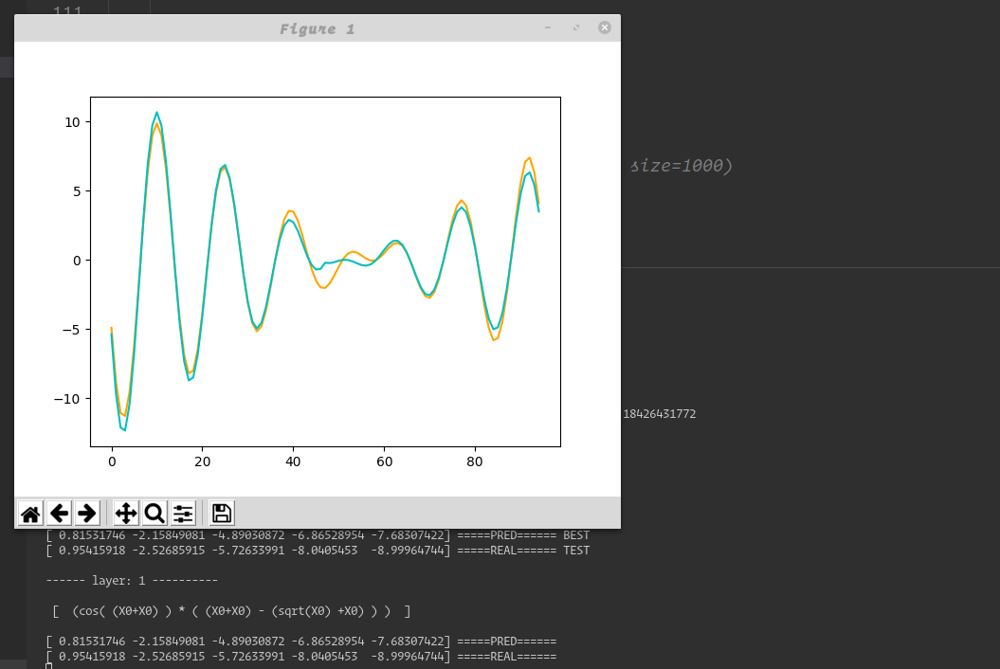
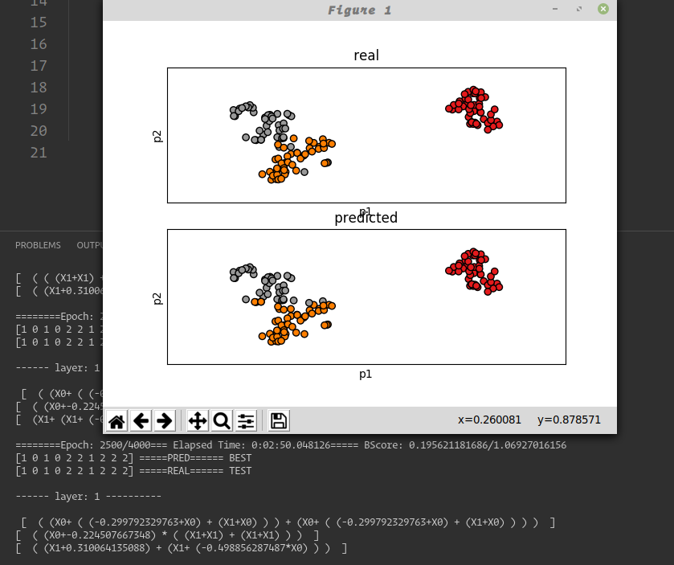

# Who Needs Neuron when you have Genome

Faster Genome Network ala Neural Network!
The Genome Network mimic the architecture of the Neural Network, contains Layers and Nodes. you can add activations and stuffs!
the Advantage is to have a real expressive formula for your network instead of weights!
Can be used for :

- Classification.
- Regression.
- Kernel finder for better understanding the data
- Feature extraction

### The Genome parameters are:

```python
nrOpts = {"opx": 2, "depth": 2, "nvars": None,
    "pvc": .7, "pf": 1., "cross": .4, "mut": .6,"mrand": .5
    }
```

### The Network parameters are:

```python
gOpts = {"mxepoch": 3000, "bsize": 64, "bupdate": 5, "fraction": .5,"history": 4,
 "mxtries": 10,"mode": this one take either "REG"  or "CLA" }
```

you can fine tune them to your need.

check the GOerationsDef.py file for the list of functions can the Genome take! you can then select what slot / group of functionalities your Genome will use for solving the problem!
set the group index in the variable "opx" of the genome option : nrOpts = {"opx": 2,..}

- group 1 : basic operations add and multiply
- group 2-3 : more general functions
- group 4: logical functions
- group 5 : all the functions

```python
class GOperationsDef:
        ...
        self._FunctSlots = {
            1: [self.mul_o, self.add_o],
            2: [self.mul_o, self.sub_o, self.add_o, self.log_o, self.sqrt_o, self.exp_o, self.cos_o, self.sin_o],
            3: [self.inv_o, self.abs_o, self.div_o, self.mul_o, self.sub_o, self.add_o, self.log_o, self.sqrt_o, self.exp_o, self.cos_o, self.sin_o],
            4: [self.max_o, self.min_o, self.if_o, self.lt_o, self.gt_o, self.not_o, self.xor_o, self.and_o, self.or_o],
            5: [self.inv_o, self.div_o, self.mod_o, self.xor_o, self.and_o, self.or_o, self.mul_o, self.sub_o, self.add_o,
                self.log_o, self.sqrt_o, self.exp_o, self.cos_o, self.sin_o, self.max_o, self.min_o, self.abs_o, self.if_o, self.gt_o, self.lt_o, self.not_o]
        }

```

## Regression



## Classification for iris example


